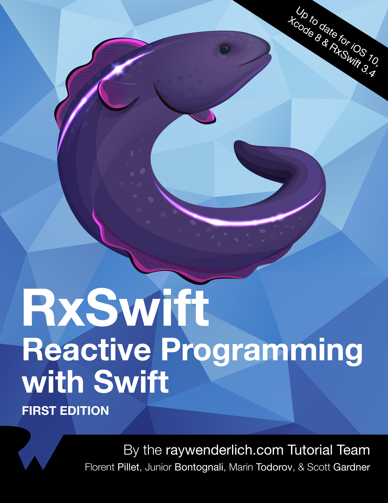

# Mash up 4기 RxSwift 스터디

## 스터디 진행
* 정기모임은 2주에 한번
* 1주일에 한 번씩 시간 되는 사람 끼리 모임
* 공부는 각자 방법으로

## 교재
* RxSwift Reactive Programming with Swift

## 과제
* 챕터당 내용 요약 정리
* 커리큘럼에 맞게 해당 주차의 챕터까지 진행

## 커리큘럼
#### 1주차 : 오리엔테이션
#### 2주차 : 챕터 1, 2